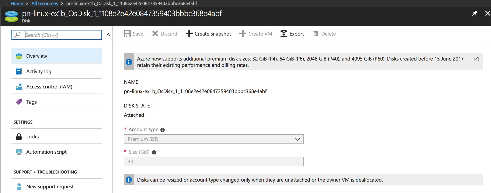

## Exercise 1:
### Create a UbuntuLTS VM and stop to observer the state:


### Create a VM using CLI:
```bash
$ az vm create \
  --resource-group pn-rg-ex1 \
  --name pn-linux-ex1b \
  --image UbuntuLTS \
  --admin-username p0n002h \
  --admin-password linux@lts123 \
  --size Standard_B1s \
  --nsg pn-linux-ex1-nsg \
  --location southindia
```
#### Response:
```json
{
  "fqdns": "",
  "id": "/subscriptions/f11a7ad6-f444-4a83-9f0d-19dd14c0d6aa/resourceGroups/pn-rg-ex1/providers/Microsoft.Compute/virtualMachines/pn-linux-ex1b",
  "location": "southindia",
  "macAddress": "00-0D-3A-F2-91-79",
  "powerState": "VM running",
  "privateIpAddress": "10.0.0.5",
  "publicIpAddress": "104.211.221.32",
  "resourceGroup": "pn-rg-ex1",
  "zones": ""
}
```

#### Stop Response:
```bash
$ az vm stop  --name pn-linux-ex1b --resource-group pn-rg-ex1
```
```json
{
  "endTime": "2018-07-30T17:44:28.236383+00:00",
  "error": null,
  "name": "efa78795-7711-4999-9290-ce5d5ef975b3",
  "startTime": "2018-07-30T17:44:12.578252+00:00",
  "status": "Succeeded"
}
```




The VM is in stopped state but not in de-allocated (Still incurring costs)[Difference between Stopped deallocated vs Stopped](https://blogs.technet.microsoft.com/gbanin/2015/04/22/difference-between-the-states-of-azure-virtual-machines-stopped-and-stopped-deallocated/)

#### Shutdown response:

It is same as the command line CLI stop response


## Exercise 3:

#### Resize using cli
```
$ az vm resize --size Standard_B1ms --name pn-linux-ex3 -g pn-rg-ex3
```
#### Response:
```json
{
  "availabilitySet": null,
  "diagnosticsProfile": {
    "bootDiagnostics": {
      "enabled": true,
      "storageUri": "https://pnrgex3diag375.blob.core.windows.net/"
    }
  },
  "hardwareProfile": {
    "vmSize": "Standard_B1ms"
  },
  "id": "/subscriptions/f11a7ad6-f444-4a83-9f0d-19dd14c0d6aa/resourceGroups/pn-rg-ex3/providers/Microsoft.Compute/virtualMachines/pn-linux-ex3",
  "identity": null,
  "instanceView": null,
  "licenseType": null,
  "location": "southindia",
  "name": "pn-linux-ex3",
  "networkProfile": {
    "networkInterfaces": [
      {
        "id": "/subscriptions/f11a7ad6-f444-4a83-9f0d-19dd14c0d6aa/resourceGroups/pn-rg-ex3/providers/Microsoft.Network/networkInterfaces/pn-linux-ex3626",
        "primary": null,
        "resourceGroup": "pn-rg-ex3"
      }
    ]
  },
  "osProfile": {
    "adminPassword": null,
    "adminUsername": "p0n002h",
    "computerName": "pn-linux-ex3",
    "customData": null,
    "linuxConfiguration": {
      "disablePasswordAuthentication": false,
      "ssh": null
    },
    "secrets": [],
    "windowsConfiguration": null
  },
  "plan": null,
  "provisioningState": "Succeeded",
  "resourceGroup": "pn-rg-ex3",
  "resources": [
    {
      "autoUpgradeMinorVersion": true,
      "forceUpdateTag": null,
      "id": "/subscriptions/f11a7ad6-f444-4a83-9f0d-19dd14c0d6aa/resourceGroups/pn-rg-ex3/providers/Microsoft.Compute/virtualMachines/pn-linux-ex3/extensions/Microsoft.Insight
s.VMDiagnosticsSettings",
      "instanceView": null,
      "location": "southindia",
      "name": "Microsoft.Insights.VMDiagnosticsSettings",
      "protectedSettings": null,
      "provisioningState": "Succeeded",
      "publisher": "Microsoft.OSTCExtensions",
      "resourceGroup": "pn-rg-ex3",
      "settings": {
        "StorageAccount": "pnrgex3diag375",
        "xmlCfg": "<Some big base64 value>",
      },
      "tags": null,
      "type": "Microsoft.Compute/virtualMachines/extensions",
      "typeHandlerVersion": "2.3",
      "virtualMachineExtensionType": "LinuxDiagnostic"
    }
  ],
  "storageProfile": {
    "dataDisks": [],
    "imageReference": {
      "id": null,
      "offer": "UbuntuServer",
      "publisher": "Canonical",
      "sku": "16.04-LTS",
      "version": "latest"
    },
    "osDisk": {
      "caching": "ReadWrite",
      "createOption": "FromImage",
      "diskSizeGb": 30,
      "encryptionSettings": null,
      "image": null,
      "managedDisk": {
        "id": "/subscriptions/f11a7ad6-f444-4a83-9f0d-19dd14c0d6aa/resourceGroups/pn-rg-ex3/providers/Microsoft.Compute/disks/pn-linux-ex3_OsDisk_1_1d51d441e57342c19ea05639b6069aac",
        "resourceGroup": "pn-rg-ex3",
        "storageAccountType": "Standard_LRS"
      },
      "name": "pn-linux-ex3_OsDisk_1_1d51d441e57342c19ea05639b6069aac",
      "osType": "Linux",
      "vhd": null,
      "writeAcceleratorEnabled": null
    }
  },
  "tags": null,
  "type": "Microsoft.Compute/virtualMachines",
  "vmId": "bef0e6ef-f241-4acd-a0bb-466b5ae666d5",
  "zones": null
}
```
* ssh connection closed
* Resizing done using Azure UI
