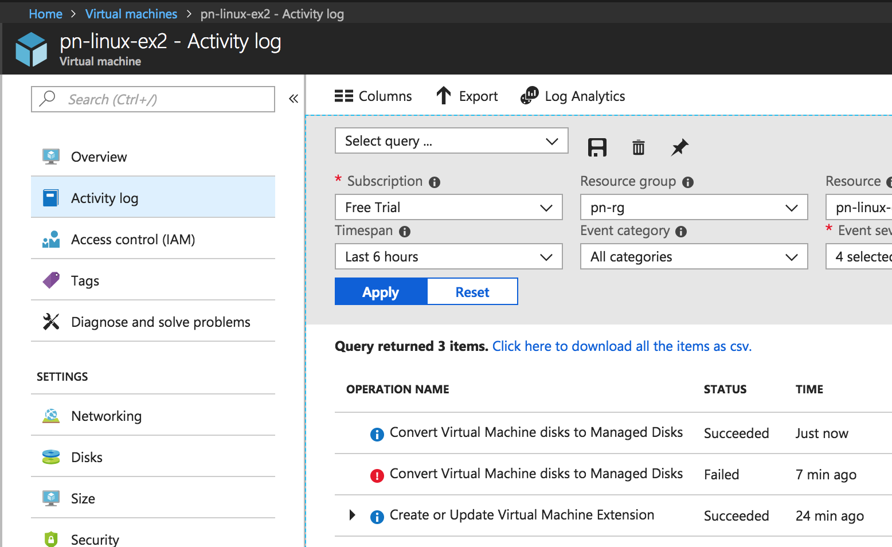
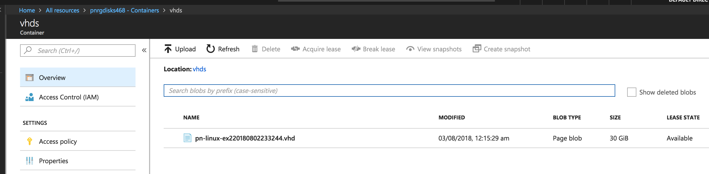
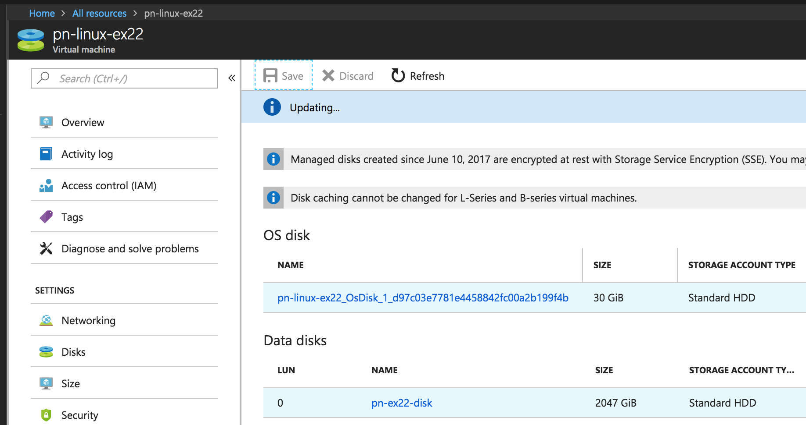
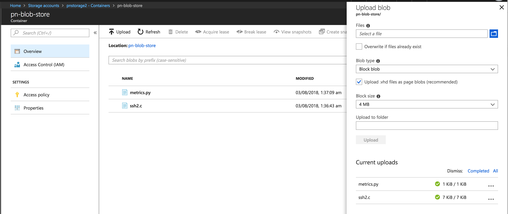

## Exercise 1:

* Create a Ubuntu 16.04 VM of size "Standard_B1s" with an unmanaged disk using the Azure Portal.
* Once the VM is created, convert your unmanaged disk to a managed disk.
* Check the storage account whether the VHD of the unmanaged disk still exist.
* Delete all the created resources.

```bash
$ az vm deallocate --resource-group pn-rg --name pn-linux-ex2
```
```json
{
  "endTime": "2018-08-02T18:47:21.285819+00:00",
  "error": null,
  "name": "c0085441-f2db-4843-860d-7ebac0269edc",
  "startTime": "2018-08-02T18:45:19.286373+00:00",
  "status": "Succeeded"
}
```

```bash
$ az vm convert --resource-group pn-rg --name pn-linux-ex2
```
```json
{
  "endTime": "2018-08-02T18:50:13.788289+00:00",
  "error": null,
  "name": "09d10401-44b9-4767-ad69-4b753d214432",
  "startTime": "2018-08-02T18:48:35.750470+00:00",
  "status": "Succeeded"
}
```



## Exercise 2:

* Create a Ubuntu 16.04 VM of size "Standard_B1s" with a managed disk using the Azure Portal.
* Create and attach a data disk of size 2 GB to the VM.
* SSH into the VM, format the newly attached data disk to an ext4 filesystem and mount it to a new directory.
* Write some Hello World files in to the new disk as well the temporary disk available (mounted by default).
* Capture the VM as an image, delete the VM and create a new VM with the image created earlier.
* SSH into the VM and check whether the data disks exist, formatted and has the file we created earlier.
* Detach the data disk, resize it to 4 GB and attach it back to the VM.
* SSH again and check the size of the disk and the contents inside it.
* Also detach the disk again and try resizing it to 2 GB.


[How to add Data disk](https://docs.microsoft.com/en-us/azure/virtual-machines/linux/attach-disk-portal)

```
$
[    0.294784] SCSI subsystem initialized
[    0.573458] Block layer SCSI generic (bsg) driver version 0.4 loaded (major 252)
[    7.110271] sd 2:0:0:0: [sda] Attached SCSI disk
[    8.079653] sd 3:0:1:0: [sdb] Attached SCSI disk
[ 1828.162306] sd 5:0:0:0: [sdc] Attached SCSI disk

$ sudo fdisk /dev/sdc
n
p
default
default

p - Print the partition table
w - write the table to disk

$ sudo mkfs -t ext4 /dev/sdc1
mke2fs 1.42.13 (17-May-2015)
Discarding device blocks: done
Creating filesystem with 524032 4k blocks and 131072 inodes
Filesystem UUID: 0cfd1eaf-6c5c-4112-be07-6cf9d9041913
Superblock backups stored on blocks:
	32768, 98304, 163840, 229376, 294912

Allocating group tables: done
Writing inode tables: done
Creating journal (8192 blocks): done
Writing superblocks and filesystem accounting information: done
```

* Click on capture
* Select Delete VM on creation of image
----
* After spining up a new VM from the image the directory is still there
* But the partition is not mounted as mount on boot was not enabled
* ```sudo mount /dev/sdc1 /datadir```
* the contents of the file are intact
----
* Resize the disk
* the disk shows up as `/dev/sdd` in `dmesg | grep SCSI`
* when looing at the partitiion table, 2 /dev show up `/dev/sdd1` and `/dev/sdd2`
* `/dev/sdd1` is already formatted in ext4
* format `/dev/sdd2` and mount.
* The original file is present in the `/dev/sdd1` partition, so it is the old partition

## Exercise 4:
* Create a new storage account of kind v1 and create a new blob container with anonymous blob read access.
* Create a new file "index.html" with some text and upload it to the container created in the last step.
* Copy the generated URL and open it using the browser.
* Create a new storage account of kind v2 and enable static web site in it.
* Provide "index.html" as the index document name and upload your index.html file to the $web container.
* Access the primary endpoint of your static website through the browser.

----
* Create a storage account
* Configure Network and firewalls to allow access from all networks
* Create a blob container
* Upload a file to blob container

link generated: https://pnstorage2.blob.core.windows.net/pn-blob-store/metrics.py
---
* Create a storage account of type v2
* Configre Network and FW to allow access from all networks
* Enable static website
* use index.html as default page
* creates a $web container in Blob
* Upload a file index.html
* the blob endpoint will show by default that page
https://pnstorage3.z30.web.core.windows.net/
