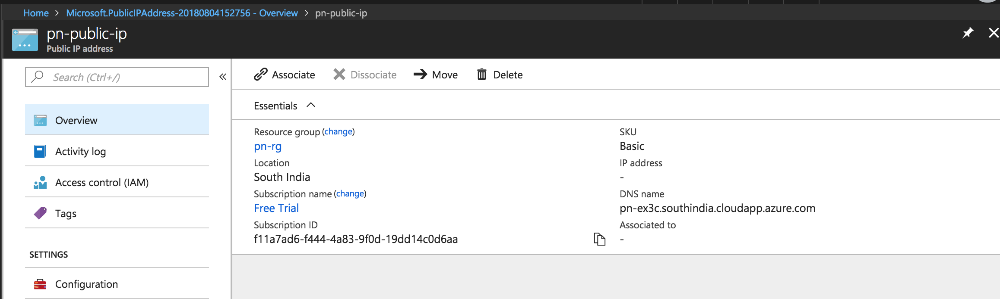

## Exercise 1:
* Create a Virtual Network and a subnet in Azure.
* Create a Network Security Group that allows port 22 and port 80 and attach this NSG to the subnet.
* Launch a Ubuntu 16.04 VM with Managed disk inside the VNet created earlier. Create a new NSG that allows port 22 and port 80 and attach it to the VM.
* SSH into the VM and install apache web server in it. Try accessing the web page by navigating your browser to the public IP of the VM.
* Remove the port 80 from the subnet NSG and try accessing the web page. * Add the port 80 again to the subnet NSG.
* Remove the port 80 from the VM NSG and try accessing the web page. Add the port 80 again to the VM NSG.
---

* The page is accessible with the New NSG created on port 80
* When removed the port 80 from Subnet NSG - page not accessible on port 80
* Added back port 80 to the subnet NSG and removed the VM NSG on port 80
* Still able to access the page on port 80

## Exercise 3
* Create a Dynamic Public IP using the Azure portal and check if any IP is provided in your public IP resource.
* Launch a Ubuntu 16.04 VM with Managed disk and attach the public IP created in the last step to this VM.
* Now check the public IP resource again. Deallocate the VM and check the public IP resouce again. Delete all the resources.
* Create a Static Public IP using the Azure portal and check if any IP is provided in your public IP resource.
* Launch another Ubuntu 16.04 VM with Managed disk and attach the public IP created in the last step to this VM.
* Now check the public IP resource again. Deallocate the VM and check the public IP resource again.

* Public IP created but IP is not assigned


* Public IP appeared when associated with VM

VM deallocated:
```bash
$ az vm deallocate -g pn-rg -n pn-linux-ex3c
{
  "endTime": "2018-08-04T10:21:28.485648+00:00",
  "error": null,
  "name": "732f16ae-e067-4ce6-aa12-04f647e1097c",
  "startTime": "2018-08-04T10:19:31.987481+00:00",
  "status": "Succeeded"
}
```
* Public IP not available when VM de-allocated
---
* Static IP created with IP without any association
* Static IP did not change when attached to the VM
* VM deallocated, public IP still exists
