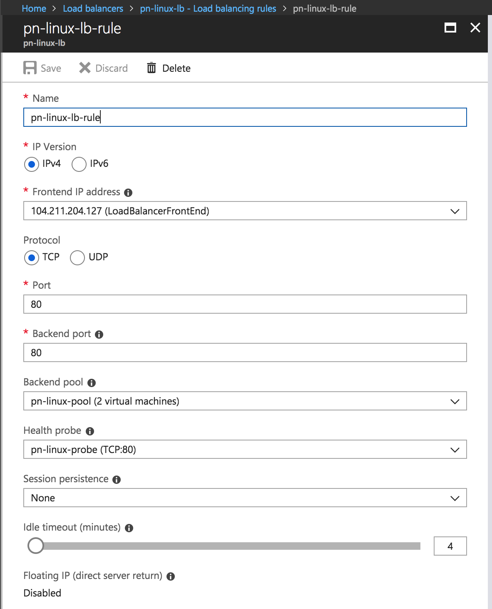
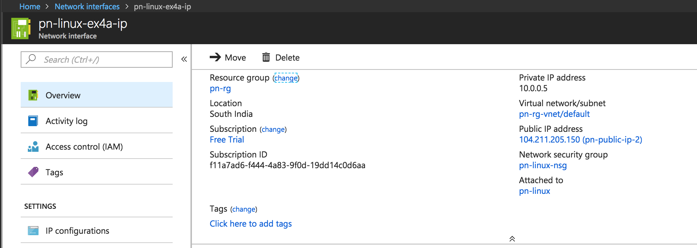

## Exercise 1:
* Launch a Ubuntu 16.04 VM with Managed disk.
* Attach one more network interface card to the VM.
* SSH into the VM and install apache web server.
* Try accessing the public IPs of both the network interface cards attached to the VM.
* Create a Basic Load Balancer and add this VM to the load balancer.
* Add both the Network Interface cards as the target network configuration to the VM.
* Access the Load balancer's IP through the browser and validate that it is distributing the requests to various Network interfaces of a virtual machine.
---
* Created a VM
* Stop the VM from the console
* Attach the new NIC
* Start the VM

```bash
$ ip a
1: lo: <LOOPBACK,UP,LOWER_UP> mtu 65536 qdisc noqueue state UNKNOWN group default qlen 1000
    link/loopback 00:00:00:00:00:00 brd 00:00:00:00:00:00
    inet 127.0.0.1/8 scope host lo
       valid_lft forever preferred_lft forever
    inet6 ::1/128 scope host
       valid_lft forever preferred_lft forever
2: eth0: <BROADCAST,MULTICAST,UP,LOWER_UP> mtu 1500 qdisc mq state UP group default qlen 1000
    link/ether 00:0d:3a:f2:6c:57 brd ff:ff:ff:ff:ff:ff
    inet 10.0.0.6/24 brd 10.0.0.255 scope global eth0
       valid_lft forever preferred_lft forever
    inet6 fe80::20d:3aff:fef2:6c57/64 scope link
       valid_lft forever preferred_lft forever
3: eth1: <BROADCAST,MULTICAST,UP,LOWER_UP> mtu 1500 qdisc mq state UP group default qlen 1000
    link/ether 00:0d:3a:f2:7a:b1 brd ff:ff:ff:ff:ff:ff
    inet 10.0.0.5/24 brd 10.0.0.255 scope global eth1
       valid_lft forever preferred_lft forever
    inet6 fe80::20d:3aff:fef2:7ab1/64 scope link
       valid_lft forever preferred_lft forever
```
```bash
$ sudo netstat -nlpt
Active Internet connections (only servers)
Proto Recv-Q Send-Q Local Address           Foreign Address         State       PID/Program name
tcp        0      0 127.0.0.1:29131         0.0.0.0:*               LISTEN      2510/mdsd
tcp        0      0 10.0.0.6:80             0.0.0.0:*               LISTEN      2902/python
tcp        0      0 10.0.0.5:80             0.0.0.0:*               LISTEN      2870/python
tcp        0      0 0.0.0.0:22              0.0.0.0:*               LISTEN      1380/sshd
tcp6       0      0 :::22                   :::*                    LISTEN      1380/sshd
```
#### Steps to create an LB

* Create a load Balancer with a new Dynamic public IP
* Add backend pool with all the Single VM
* Add health probe
* Add load balancing rule

This would show up and provided the IP to dynamic IP.




Notes:
* Make sure that the 2 networks are in the same vnet (not sure if required)
* Make sure both have a public IP associated with it
* test that both of them can access internet by pinging
```
$ ping -I <ip_of_interface> google.com
```

* If not, need to add routing table for the new interface

```
$ echo 150 <rule_name> >> /etc/iproute2/rt_tables

$ ip rule add from <interface_ip> lookup <rule_name>
$ ip route add default via <gateway_ip> dev <interface_name> table <rule_name>
```
`10.0.0.5 -> Gateway (10.0.0.1)`

src: [Adding a new interface to VM](https://docs.microsoft.com/en-us/azure/virtual-network/virtual-network-multiple-ip-addresses-portal)

##### Some screens



