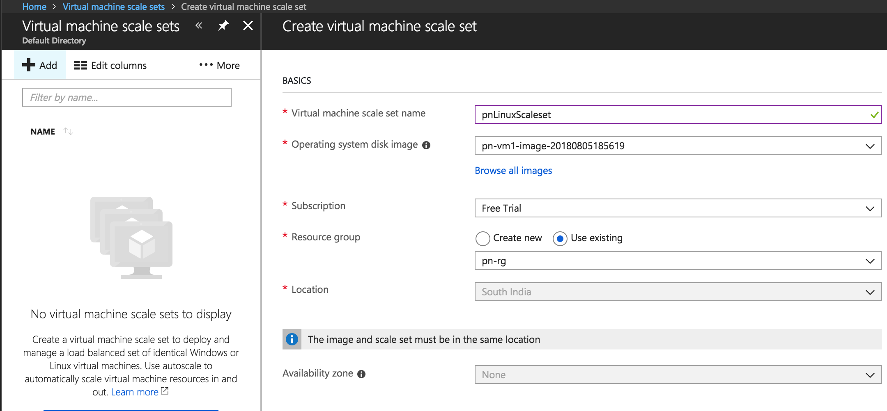
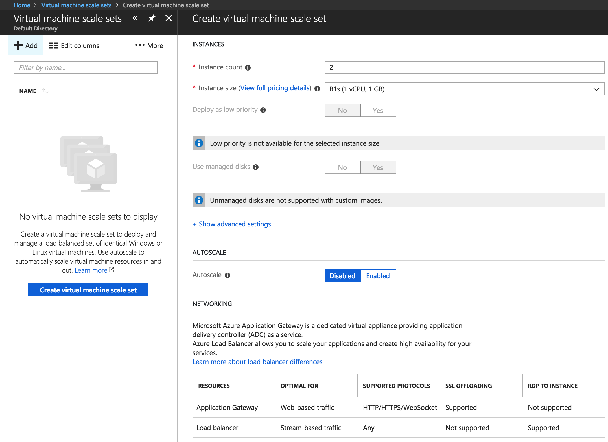
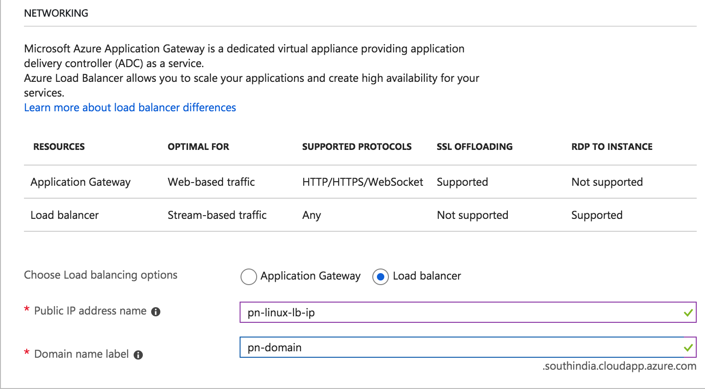
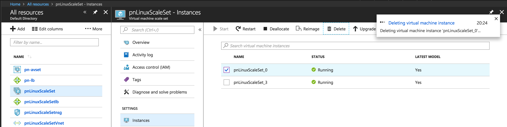
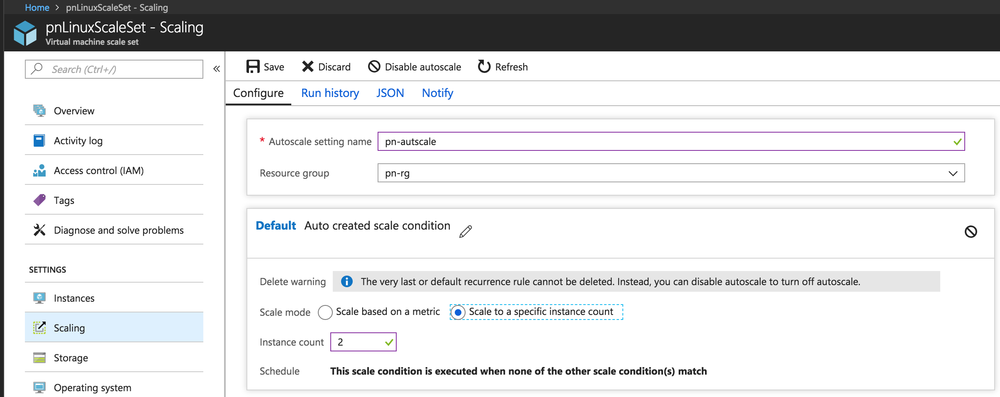
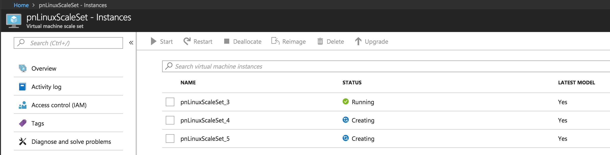

## Exercise 1:

1. Launch a Ubuntu 16.04 VM with Managed disk, SSH into the machine, install Apache web server and capture the machine as a VM Image.
2. Create a Virtual Machine scale set with the image created in the last step. Use "south india" as the location for your VM Scale set.
3. Also, use 2 as the instance count, "Standard_B1s" as the instance size and do not use managed disks for your scale set.
4. Let the autoscale be disabled and use load balancer to distribute your requests among VMs in your scale set.
5. Once your VM Scale set is ready, try accessing its load balancer public IP on your browser.
6. Delete one of your VMs in your scale set and check whether it is created again automatically.
7. If not, enable autoscaling in your scale set and set the scale mode to a specific instance count. Make sure your instance count is 2.
8. Repeat the step 6.

---
**Resource** : [Scale set using az CLI](https://docs.microsoft.com/en-us/azure/virtual-machine-scale-sets/tutorial-use-custom-image-cli)
* Unmanaged disks are not supported with custom images
* To find custom image do show all images




* Delete one of the VMs in the scale set

* Another VM is not created without Autoscaling
* Creating a Scale set based on instance count

* When scale set created, then VMs spin up based on the scale set


---
## Exercise 3:

1. Create a Virtual Machine scale set with "south india" as the location using Azure CLI.
2. use 2 as the instance count, "Standard_B1s" as the instance size, let the autoscale be disabled and use load balancer to distribute your requests among VMs in your scale set.
3. Using azure CLI, increase the instance count. Likewise, decrease the instance count.
4. Write a script that retrieves the CPU utilization metric of your VM Scale set and increases the Instance count by one, if this metric is greater than a specific value.
5. Similarly, it should decrease the instance count by one, if the CPU utilization metric is lesser than a given value.


* Create a resource group
```bash
$ az group create --name pn-resgrp --location southindia
{
  "id": "/subscriptions/f11a7ad6-f444-4a83-9f0d-19dd14c0d6aa/resourceGroups/pn-resgrp",
  "location": "southindia",
  "managedBy": null,
  "name": "pn-resgrp",
  "properties": {
    "provisioningState": "Succeeded"
  },
  "tags": null
}
```
* Create the scale set
```bash
$ az vmss create --image UbuntuLTS -g pn-resgrp -n pn-linux-ss -l southindia --image UbuntuLTS --vm-sku Standard_B1s --admin-username p0n002h --admin-password linux@lts123 --instance-count 2 --lb pn-linux-lb
```
```json
{
  "vmss": {
    "overprovision": true,
    "provisioningState": "Succeeded",
    "singlePlacementGroup": true,
    "uniqueId": "004d6f9f-a1c5-4849-97c8-7b9f32e075c2",
    "upgradePolicy": {
      "automaticOSUpgrade": false,
      "mode": "Manual"
    },
    "virtualMachineProfile": {
      "networkProfile": {
        "networkInterfaceConfigurations": [
          {
            "name": "pnline2c9Nic",
            "properties": {
              "dnsSettings": {
                "dnsServers": []
              },
              "enableAcceleratedNetworking": false,
              "enableIPForwarding": false,
              "ipConfigurations": [
                {
                  "name": "pnline2c9IPConfig",
                  "properties": {
                    "loadBalancerBackendAddressPools": [
                      {
                        "id": "/subscriptions/f11a7ad6-f444-4a83-9f0d-19dd14c0d6aa/resourceGroups/pn-resgrp/providers/Microsoft.Network/loadBalancers/pn-linux-lb/backendAddressPools/pn-linux-lbBEPool",
                        "resourceGroup": "pn-resgrp"
                      }
                    ],
                    "loadBalancerInboundNatPools": [
                      {
                        "id": "/subscriptions/f11a7ad6-f444-4a83-9f0d-19dd14c0d6aa/resourceGroups/pn-resgrp/providers/Microsoft.Network/loadBalancers/pn-linux-lb/inboundNatPools/pn-linux-lbNatPool",
                        "resourceGroup": "pn-resgrp"
                      }
                    ],
                    "privateIPAddressVersion": "IPv4",
                    "subnet": {
                      "id": "/subscriptions/f11a7ad6-f444-4a83-9f0d-19dd14c0d6aa/resourceGroups/pn-resgrp/providers/Microsoft.Network/virtualNetworks/pn-resgrp-vnet/subnets/default",
                      "resourceGroup": "pn-resgrp"
                    }
                  }
                }
              ],
              "primary": true
            }
          }
        ]
      },
      "osProfile": {
        "adminUsername": "p0n002h",
        "computerNamePrefix": "pnline2c9",
        "linuxConfiguration": {
          "disablePasswordAuthentication": false
        },
        "secrets": []
      },
      "storageProfile": {
        "imageReference": {
          "offer": "UbuntuServer",
          "publisher": "Canonical",
          "sku": "16.04-LTS",
          "version": "latest"
        },
        "osDisk": {
          "caching": "ReadWrite",
          "createOption": "FromImage",
          "managedDisk": {
            "storageAccountType": "Premium_LRS"
          }
        }
      }
    }
  }
}
```

* Increase capacity
```bash
$ az vmss scale -g pn-resgrp -n pn-linux-ss --new-capacity 3
```

* Get metrics for VM Scale Set
```bash
$ az monitor metrics list --resource /subscriptions/f11a7ad6-f444-4a83-9f0d-19dd14c0d6aa/resourceGroups/pn-resgrp/providers/Microsoft.Compute/virtualMachineScaleSets/pn-linux-ss --metric "Percentage CPU" --interval PT30M
```
```json
{
  "cost": 0.0,
  "interval": "0:30:00",
  "namespace": "Microsoft.Compute/virtualMachineScaleSets",
  "resourceregion": "southindia",
  "timespan": "2018-08-05T17:58:54Z/2018-08-05T18:58:54Z",
  "value": [
    {
      "id": "/subscriptions/f11a7ad6-f444-4a83-9f0d-19dd14c0d6aa/resourceGroups/pn-resgrp/providers/Microsoft.Compute/virtualMachineScaleSets/pn-linux-ss/providers/Microsoft.Insights/metrics/Percentage CPU",
      "name": {
        "localizedValue": "Percentage CPU",
        "value": "Percentage CPU"
      },
      "resourceGroup": "pn-resgrp",
      "timeseries": [
        {
          "data": [
            {
              "average": null,
              "count": null,
              "maximum": null,
              "minimum": null,
              "timeStamp": "2018-08-05T17:58:00+00:00",
              "total": null
            },
            {
              "average": 0.6794029850746268,
              "count": null,
              "maximum": null,
              "minimum": null,
              "timeStamp": "2018-08-05T18:28:00+00:00",
              "total": null
            }
          ],
          "metadatavalues": []
        }
      ],
      "type": "Microsoft.Insights/metrics",
      "unit": "Percent"
    }
  ]
}
```
Resource: [Metrics using Azure CLI](https://docs.microsoft.com/en-us/cli/azure/monitor/metrics?view=azure-cli-latest)
