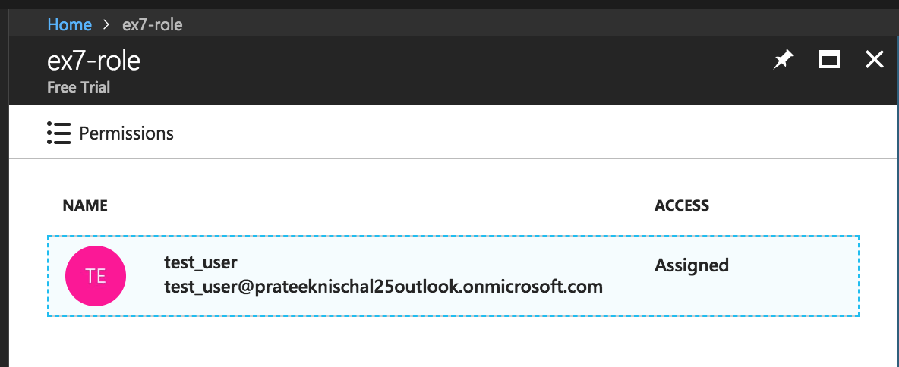

## Exercise 2:
1. Create a new user using Azure CLI.
2. List all the built-in roles definitions in the following format. An array of objects with name, roleName and description of each role.
3. Create a new role definition using CLI that allows the following actions under a subscriptions scope.
  1. Read-only access to Storage resources.
  2. Read-only access to Network resources.
  3. Start and Stop access to Virtual Machines.
4. Attach this role to your new user under subscription's scope using Azure CLI.
5. Navigate to your subscriptions portal and check whether a new role assignment has been created.
6. Login as a new user in an incognito window and check whether you are able read the Storage and Network resources.
7. Delete the role assignment, the role definition and the user as well using Azure CLI.
---
* Create a user using CLI :[azure ad user](https://docs.microsoft.com/en-us/cli/azure/ad/user?view=azure-cli-latest)
```bash
$ az ad user create --display-name test_user --password linux@lts123 --user-principal-name test_user@prateeknischal25outlook.onmicrosoft.com
```
```json
{
  "accountEnabled": true,
  "ageGroup": null,
  "assignedLicenses": [],
  "assignedPlans": [],
  "city": null,
  "companyName": null,
  "consentProvidedForMinor": null,
  "country": null,
  "createdDateTime": null,
  "creationType": null,
  "deletionTimestamp": null,
  "department": null,
  "dirSyncEnabled": null,
  "displayName": "test_user",
  "employeeId": null,
  "facsimileTelephoneNumber": null,
  "givenName": null,
  "immutableId": null,
  "isCompromised": null,
  "jobTitle": null,
  "lastDirSyncTime": null,
  "legalAgeGroupClassification": null,
  "mail": null,
  "mailNickname": "test_user",
  "mobile": null,
  "objectId": "b44a41f7-2e43-405d-acbd-4ab583a464f6",
  "objectType": "User",
  "odata.metadata": "https://graph.windows.net/f7bae02f-d98c-4fbf-ac7e-791e026bc7bc/$metadata#directoryObjects/Microsoft.DirectoryServices.User/@Element",
  "odata.type": "Microsoft.DirectoryServices.User",
  "onPremisesDistinguishedName": null,
  "onPremisesSecurityIdentifier": null,
  "otherMails": [],
  "passwordPolicies": null,
  "passwordProfile": null,
  "physicalDeliveryOfficeName": null,
  "postalCode": null,
  "preferredLanguage": null,
  "provisionedPlans": [],
  "provisioningErrors": [],
  "proxyAddresses": [],
  "refreshTokensValidFromDateTime": "2018-08-05T19:33:18.3121464Z",
  "showInAddressList": null,
  "signInNames": [],
  "sipProxyAddress": null,
  "state": null,
  "streetAddress": null,
  "surname": null,
  "telephoneNumber": null,
  "usageLocation": null,
  "userIdentities": [],
  "userPrincipalName": "test_user@prateeknischal25outlook.onmicrosoft.com",
  "userState": null,
  "userStateChangedOn": null,
  "userType": "Member"
}
```

* list of all built-in roles
```bash
$ az role definition list
```

* Create a role
```bash
$ az role definition create --role-definition '{
            "Name": "ex7-role",
            "Description": "storage r, network r, vm start stop",
            "Actions": [
                "Microsoft.Compute/virtualMachines/start/action",
                "Microsoft.Compute/virtualMachines/restart/action",
                "Microsoft.Network/*/read",
                "Microsoft.Storage/*/read"
            ],
            "AssignableScopes": ["/subscriptions/<id>"]
        }'
```
```bash
$ az role definition list -n ex7-role
```
```json
[
  {
    "assignableScopes": [
      "/subscriptions/<id>"
    ],
    "description": "storage r, network r, vm start stop",
    "id": "/subscriptions/<id>/providers/Microsoft.Authorization/roleDefinitions/1a8cc1f0-6f3c-4851-b8cb-25d46f82e697",
    "name": "1a8cc1f0-6f3c-4851-b8cb-25d46f82e697",
    "permissions": [
      {
        "actions": [
          "Microsoft.Compute/virtualMachines/start/action",
          "Microsoft.Compute/virtualMachines/restart/action",
          "Microsoft.Network/*/read",
          "Microsoft.Storage/*/read"
        ],
        "dataActions": [],
        "notActions": [],
        "notDataActions": []
      }
    ],
    "roleName": "ex7-role",
    "roleType": "CustomRole",
    "type": "Microsoft.Authorization/roleDefinitions"
  }
]
```
OR
```bash
$ az role definition list --custom-role-only
```
* Assign the role to the new created user
```bash
$ az role assignment create --role ex7-role --assignee test_user@prateeknischal25outlook.onmicrosoft.com
```
```json
{
  "canDelegate": null,
  "id": "/subscriptions/f11a7ad6-f444-4a83-9f0d-19dd14c0d6aa/providers/Microsoft.Authorization/roleAssignments/8d9143d7-3fbc-4051-9675-e1515980259c",
  "name": "8d9143d7-3fbc-4051-9675-e1515980259c",
  "principalId": "b44a41f7-2e43-405d-acbd-4ab583a464f6",
  "roleDefinitionId": "/subscriptions/f11a7ad6-f444-4a83-9f0d-19dd14c0d6aa/providers/Microsoft.Authorization/roleDefinitions/1a8cc1f0-6f3c-4851-b8cb-25d46f82e697",
  "scope": "/subscriptions/f11a7ad6-f444-4a83-9f0d-19dd14c0d6aa",
  "type": "Microsoft.Authorization/roleAssignments"
}
```

* Able to see network resources
